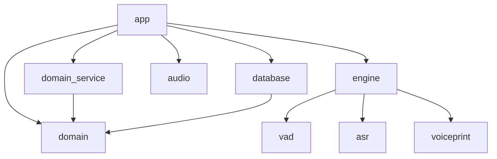

# アーキテクチャガイド

> VoiceAuth のアーキテクチャ設計

## コンセプト

**Disposable Architecture（使い捨て可能なアーキテクチャ）** を採用します。

- フレームワーク（FastAPI → Django、Litestar 等）を容易に差し替え可能
- 音声認識モデル（SenseVoice → 他モデル）を容易に差し替え可能
- ビジネスロジック（domain, domain_service）は外部ライブラリに依存しない

## モジュール構成

**Modular Monolith** 構成を採用します。
各機能は独立した Python モジュールとして管理され、明確な責務と依存方向を持ちます。

### Disposable モジュール（ライブラリ依存、差し替え可能）

| モジュール | 役割 | 主な依存 |
|---|---|---|
| **database** | DB接続、Store実装、マイグレーション | SQLModel, Alembic |
| **audio** | 音声処理全般（変換、リサンプリング等） | PyAV |
| **engine/vad** | 発話区間検出 | sherpa-onnx (Silero VAD) |
| **engine/asr** | 音声認識 | sherpa-onnx (SenseVoice) |
| **engine/voiceprint** | 声紋認識 | sherpa-onnx (CAM++) |

### Non-Disposable モジュール（ライブラリ非依存、コア部分）

| モジュール | 役割 |
|---|---|
| **domain** | ドメインモデル（Entity, ValueObject）、Protocol 定義 |
| **domain_service** | ビジネスロジック（ユースケース） |

### アプリケーション層

| モジュール | 役割 | 主な依存 |
|---|---|---|
| **app** | Webフレームワーク実装、Composition Root、DI | FastAPI, Pydantic |

## ディレクトリ構成

```
voiceauth/                          # プロジェクトルート
├── pyproject.toml                  # 依存関係
├── uv.lock                         # ロックファイル
├── main.py                         # エントリポイント（アプリケーション起動）
├── alembic.ini                     # Alembic設定
│
└── voiceauth/                      # パッケージルート
    ├── __init__.py
    │
    ├── domain/                     # 【ドメイン層】
    │   ├── __init__.py
    │   ├── prompt_generator.py     # プロンプト生成ロジック
    │   ├── models/                 # ドメインモデル（ORM非依存）
    │   │   ├── speaker.py          # 話者エンティティ
    │   │   └── voiceprint.py       # 声紋値オブジェクト
    │   └── protocols/              # 外部への要求仕様（Protocol定義）
    │       ├── vad.py              # VAD Protocol
    │       ├── asr.py              # ASR Protocol
    │       ├── voiceprint.py       # 声紋認識 Protocol
    │       ├── audio.py            # 音声処理 Protocol
    │       ├── store.py            # Store Protocol
    │       ├── enrollment.py       # 登録フロー Protocol
    │       └── verify.py           # 認証フロー Protocol
    │
    ├── domain_service/             # 【ドメインサービス層】
    │   ├── __init__.py
    │   ├── settings.py             # ドメインサービス設定（閾値等）
    │   ├── enrollment.py           # 登録フロー（ステートマシン）
    │   └── verify.py               # 認証フロー
    │
    ├── app/                        # 【アプリケーション層 / Composition Root】
    │   ├── __init__.py
    │   ├── main.py                 # FastAPIアプリケーション定義
    │   ├── settings.py             # サーバー設定（Host, Port, LogLevel）
    │   ├── dependencies.py         # DI設定（FastAPI Depends）
    │   ├── model_loader.py         # MLモデルのロード・シングルトン管理
    │   ├── dto/                    # リクエスト/レスポンス型定義
    │   ├── routers/                # エンドポイント定義
    │   │   └── demo.py             # デモ画面用 API
    │   ├── websocket/              # WebSocket固有実装
    │   │   ├── enrollment.py       # 登録WebSocket
    │   │   └── verify.py           # 認証WebSocket
    │   ├── templates/              # HTMLテンプレート（デモUI）
    │   │   └── demo.html
    │   └── static/                 # 静的ファイル（デモUI）
    │       └── js/
    │
    ├── database/                   # 【データベース層】
    │   ├── __init__.py
    │   ├── exceptions.py           # DB関連の例外
    │   ├── migrations/             # マイグレーションスクリプト
    │   │   ├── env.py
    │   │   ├── script.py.mako
    │   │   └── versions/
    │   ├── settings.py             # DB設定（URL等）
    │   ├── session.py              # DBセッション管理
    │   ├── models.py               # SQLModelモデル（ORM定義）
    │   └── stores/                 # Store実装
    │       └── speaker_store.py
    │
    ├── audio/                      # 【音声処理】
    │   ├── __init__.py
    │   └── converter.py            # フォーマット変換（WebM→PCM等）
    │
    └── engine/                     # 【音声AIエンジン群】
        ├── __init__.py
        ├── settings.py             # エンジン設定（モデルパス、スレッド数等）
        ├── exceptions.py           # エンジン関連の例外
        │
        ├── vad/                    # 【VAD実装】
        │   ├── __init__.py
        │   └── silero.py           # Silero VAD実装
        │
        ├── asr/                    # 【ASR実装】
        │   ├── __init__.py
        │   ├── sensevoice.py       # SenseVoice実装
        │   └── segmentation.py     # デジット分割処理
        │
        └── voiceprint/             # 【声紋認識実装】
            ├── __init__.py
            └── campp.py            # CAM++実装
```

## 依存の流れ

```
app → { domain_service, domain, database, audio, engine/* }
domain_service → domain
database → domain
audio, engine/* → (依存なし)
```



## 依存性逆転（Protocol パターン）

domain_service は、音声処理や永続化の具象実装に直接依存しない。
代わりに domain/protocols/ に Protocol（インターフェース）を定義し、各 Disposable モジュールがその Protocol を実装する。

```python
# voiceauth/domain/protocols/asr.py
from typing import Protocol

class ASRProtocol(Protocol):
    def transcribe(self, audio: bytes) -> str:
        ...
```

```python
# voiceauth/engine/asr/sensevoice.py
class SenseVoiceASR:
    def transcribe(self, audio: bytes) -> str:
        # sherpa-onnx を使った実装
        ...
```

app は Composition Root として機能し、dependencies.py で各 Disposable モジュールの具象実装を domain_service に注入する。
これにより、domain_service は外部機能の詳細を知らずにビジネスロジックを実行できる。

```python
# voiceauth/app/dependencies.py
from fastapi import Depends
from voiceauth.engine.asr.sensevoice import SenseVoiceASR
from voiceauth.domain.protocols.asr import ASRProtocol

def get_asr() -> ASRProtocol:
    return SenseVoiceASR()
```

## 開発ガイドライン

### 1. 依存の方向

- `domain` は他のモジュールを import してはいけない
- `domain_service` は `domain` のみを import できる
- 必要な外部機能は必ず `domain/protocols/` に定義し、DI で受け取る

### 2. 設定の管理

- 各モジュールは独立した `settings.py` を持つ
- 設定値は環境変数から読み込む

### 3. 型安全性

- 全モジュールに `py.typed` を配置
- Protocol に対する実装クラスの適合性は `mypy`（静的解析）でチェック

### 4. 例外処理

- 各モジュール内で発生したエラーは独自の例外クラスとして送出（例: `database/exceptions.py`, `engine/exceptions.py`）

### 5. WebSocket

- WebSocket は app 固有の実装として扱う
- ステートフルな通信のため、Disposable な抽象化は行わない

## テスト構成

テストファイルはテスト対象と同じディレクトリに配置する。
**結合テスト中心** の戦略を採用し、app 層での E2E テストを主とする。

domain_service のテストでは、各 Disposable モジュールをモックに差し替えることで高速に実行可能。

### テストファイル命名規則

- ファイル名: `test_*.py`（例: `test_auth.py`, `test_enrollment.py`）
- テスト対象と同じディレクトリに配置
- pytest のデフォルト規則に従う

```
voiceauth/app/
├── dependencies.py
├── test_dependencies.py    # 同じ階層に配置
└── websocket/
    ├── enrollment.py
    └── test_enrollment.py  # 同じ階層に配置
```
